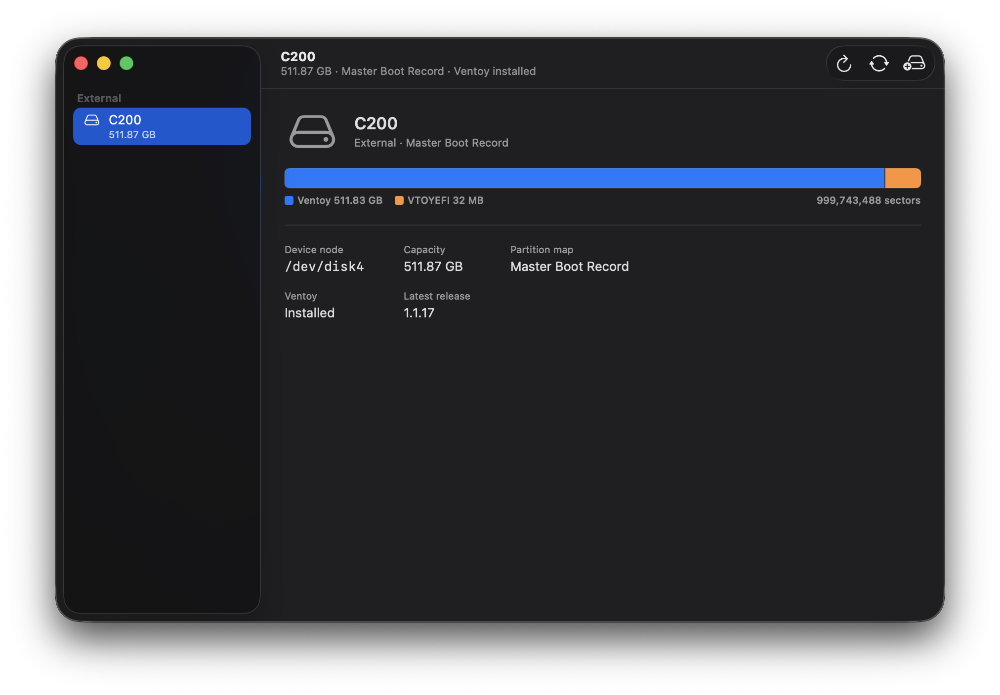
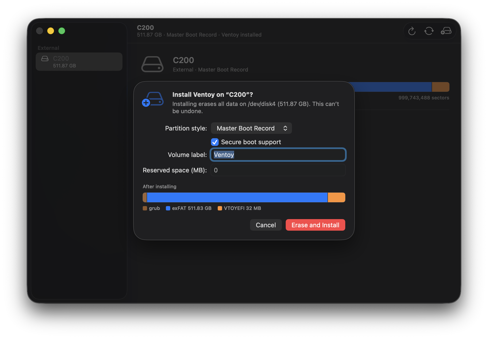
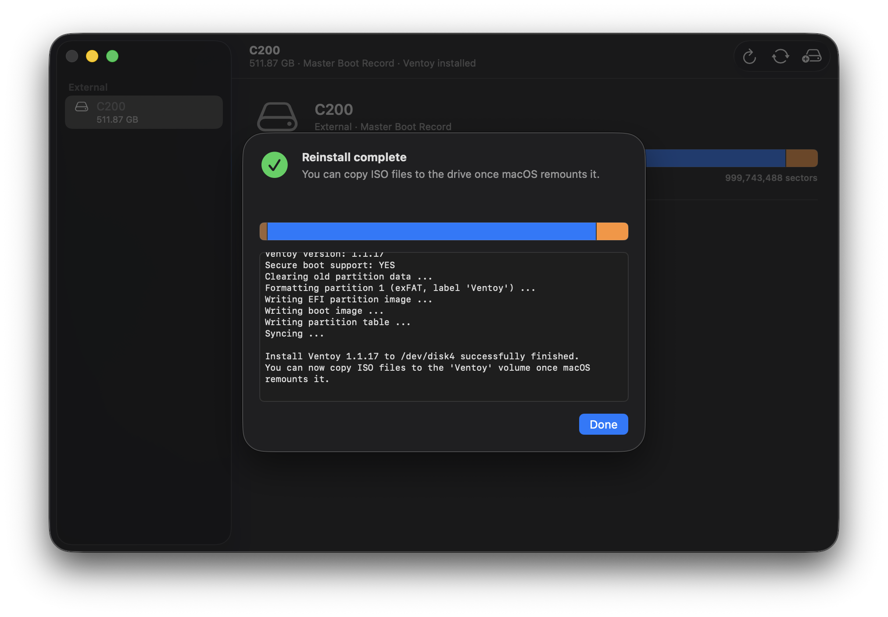

# ventoy-mac

This is a native macOS port of the official `Ventoy2Disk` ventoy installer cli & gui.

[Ventoy](https://www.ventoy.net) allows you to turn a USB into a multi-iso bootable disk.
This allows you to carry a single usb drive and use it for your files as well as the occasional OS
install.

I daily drive a mac, and occationaly I need to reformat my daily driver usb drive, it's always frustrating
to have to pull out my linux or windows box to reformat my drive to Ventoy once I'm done.  I hope this is
useful to you too!

Many thanks to [longpanda](https://github.com/ventoy) for their amazing software.

<p align="center">
  
</p>

<p align="center">
  
  
</p>

## Installation

```sh
brew install --cask fcjr/fcjr/ventoy2disk # install the gui app
brew install --cask fcjr/fcjr/ventoy2disk-cli # install the ventoy2disk cli
```

Or grab the [latest release](https://github.com/fcjr/ventoy-mac/releases/latest).

## Usage

Open the app, pick your drive, on the left hand side, click the `+` on the top right, set your desired info,
then hit `Erase and Install`.

Or using the ventoy2disk cli:

```sh
diskutil list external          # find your drive
sudo ventoy2disk -i /dev/disk4  # install
sudo ventoy2disk -u /dev/disk4  # update Ventoy, keeping your files
sudo ventoy2disk -l /dev/disk4  # show what's installed
```

Run `ventoy2disk -h` for the full option list.

## License

GPLv3+, same as Ventoy. Partition layout logic and vendored components are
derived from the Ventoy project, Copyright (c) longpanda <admin@ventoy.net>.
